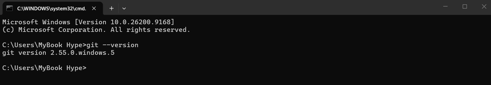
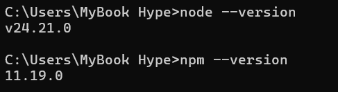
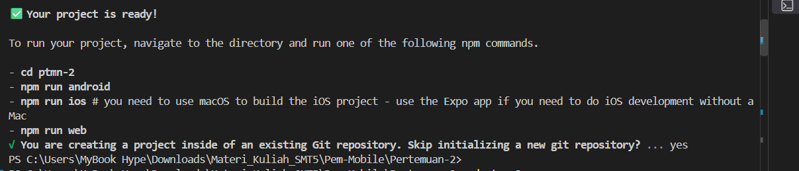
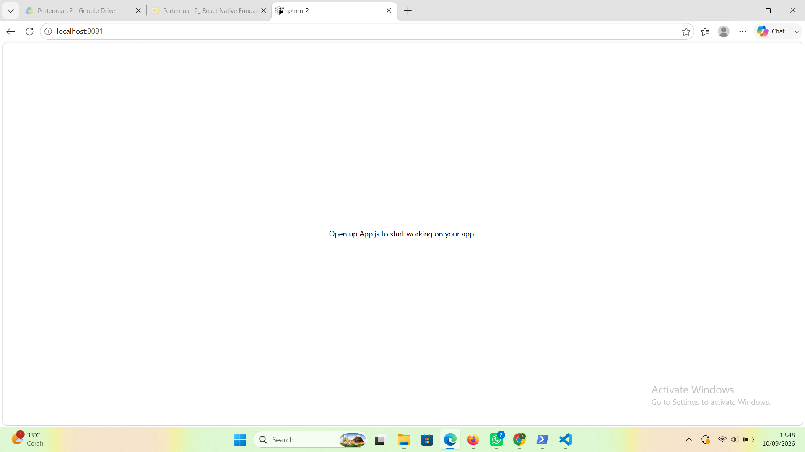
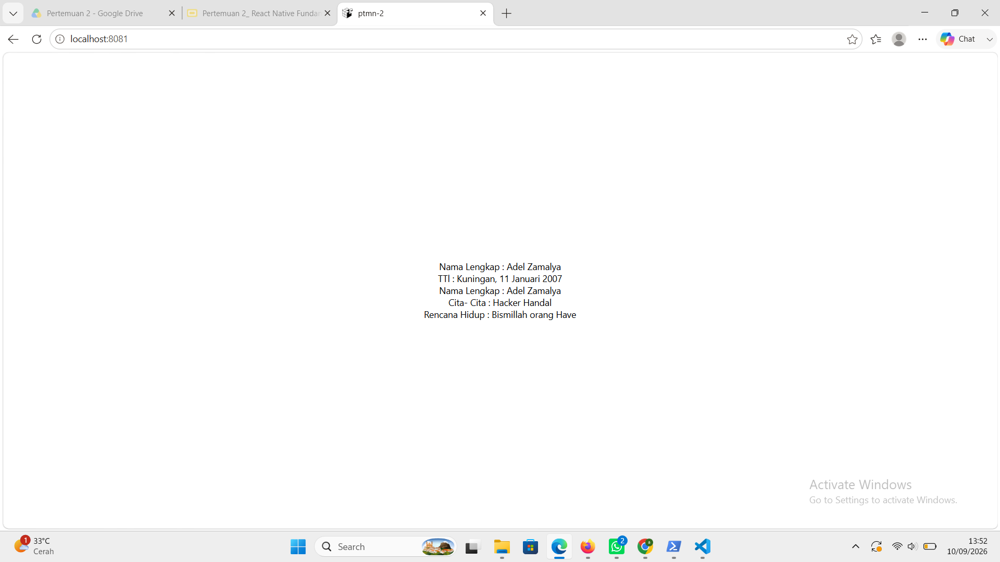

# **Praktikum Mentiapkan Memulai Pemrograman Mobile dengann React Native**

## **Tujuan Pembelajaran **

setelah menyelesaikam modul praktikum ini, mahasiswa mampu:

- Menginstal Git dan Github
- Menginstal Node.js dan NPM
- Menginstal Expo CLI
- Membuat project React Native
- Menjalankan project React Native

1. Install Git di local
   - Unduh dan Install Git Via https://git-scm.com/install/windows
   - Verifikasi Git
     

2. Install Node JS
   - Unduh dan Instal Node JS Via https://nodejs.org/en/download
   - verifikasi node js S
     

3. Memulai project dengan Fremwork Expo
   - Buka terminal pada code editor
   - Pastikan aktif di directory ang dituju
   - Ketikan (npx create-expo-app ptmn-2 --template blank )
     

4. Menjalankan project React Native
   - Masuk ke directory project (cd ptmn2)
   - Jalankan projek (npx expo start)
   - Scan QR code dengan Aplikasi Expo Go
   - Jika ingin run emulator di WEB ketik w
   - di terminal "npx expo install react-dom react-native-web"
   - npx expo start --web
     

5. LATIHAN PERTEMUAN-2
   - Tambahkan teks berupa
   - Nama Lengkap
   - Tempat tanggal lahir
   - Cita cita
   - Rencana hidup
     
